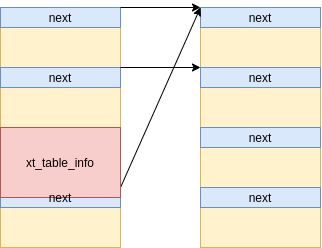
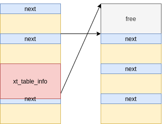
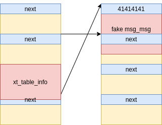
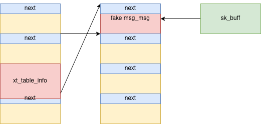
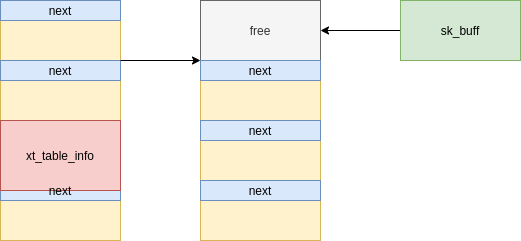
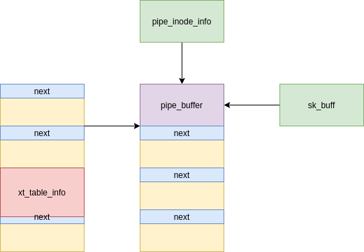

# CVE-2021-22555分析

## 环境搭建

本次复现使用Ubuntu20.04。

系统安装完毕后，切换内核版本：

```shell
$sudo apt install linux-headers-5.8.0-48-generic\
linux-image-5.8.0-48-generic\
linux-modules-5.8.0-48-generic\
linux-modules-extra-5.8.0-48-generic
$sudo vim /etc/default/grub #将GRUB_DEFAULT=0替换为
                            #GRUB_DEFAULT="Advanced options for Ubuntu>Ubuntu, with Linux 5.8.0-48-genetic"
$sudo update-grub
$sudo reboot
```

按照docker官网文档安装docker，下载ubuntu20.04镜像，运行docker时需要关闭seccomp：

```bash
 docker run -v /tmp/:/test/ --security-opt=seccomp:unconfined -it fb52e22af1b0 /bin/bash
```


## 前置知识

本小节介绍漏洞所涉及的模块中一些关键函数和结构体。

本漏洞涉及Netfilter模块中`IPT_SO_SET_REPLACE`操作。首先简要介绍一下Netfilter模块和iptables，Netfilter 是Linux内核中进行数据包过滤、连接跟踪、地址转换等的主要实现模块，为不同协议族定义了各自一套hook点以及将过滤规则存放在几个表中供hook函数使用；iptables是用户态的配置工具，用于实现网络层的防火墙，用户可以通过iptables命令设置一系列的过滤规则，来截获特定的数据包并进行过滤或其他处理，是用户空间和内核netfilter模块通信的手段。

当用户配置了一条iptables规则后，会传递给内核一个`ipt_replace`结构:

```c
/* The argument to IPT_SO_SET_REPLACE. */
struct ipt_replace {
	/* Which table. */
	char name[XT_TABLE_MAXNAMELEN];
	/* Which hook entry points are valid: bitmask.  You can't
           change this. */
	unsigned int valid_hooks;
	/* Number of entries */
	unsigned int num_entries;
	/* Total size of new entries */
	unsigned int size;
	/* Hook entry points. */
	unsigned int hook_entry[NF_INET_NUMHOOKS];
	/* Underflow points. */
	unsigned int underflow[NF_INET_NUMHOOKS];
	/* Information about old entries: */
	/* Number of counters (must be equal to current number of entries). */
	unsigned int num_counters;
	/* The old entries' counters. */
	struct xt_counters __user *counters;
	/* The entries (hang off end: not really an array). */
	struct ipt_entry entries[0];
};
```

该结构包含表名，规则挂载的hook入口点，规则数，新规则信息等。每一条规则包含三个部分`ipt_entry`、`ipt_entry_matches`、`ipt_entry_target`。

`ipt_entry`结构主要保存标准匹配的内容:

```c
struct ipt_entry {
	struct ipt_ip ip;
	/* Mark with fields that we care about. */
	unsigned int nfcache;
	/* Size of ipt_entry + matches */
	__u16 target_offset;
	/* Size of ipt_entry + matches + target */
	__u16 next_offset;
	/* Back pointer */
	unsigned int comefrom;
	/* Packet and byte counters. */
	struct xt_counters counters;
	/* The matches (if any), then the target. */
	unsigned char elems[0];
};
```

`ipt_entry_matches`由多个`ipt_entry_match`组成，`ipt_entry_match` 结构主要保存扩展匹配的内容，这里的匹配主要是指与IP无关的防火墙规则信息，由系统缺省设置的匹配主要有三个“tcp”、“udp”，“icmp”。，内核中对应`xt_entry_match`结构：

```C
struct xt_entry_match {
	union {
		struct {
			__u16 match_size;
			/* Used by userspace */
			char name[XT_EXTENSION_MAXNAMELEN];
			__u8 revision;
		} user;
		struct {
			__u16 match_size;
			/* Used inside the kernel */
			struct xt_match *match;
		} kernel;
		/* Total length */
		__u16 match_size;
	} u;
	unsigned char data[0];
};
```

 `ipt_entry_target`结构是决定一个分组action信息，指当一个分组与rule和match信息匹配后，如何处置该分组。处置方法一般有三种：一，命令常数，比如DROP ACCEPT等等；二 系统预定义的模块处理函数，比如”SNAT DNAT"等等；第三种是用户自己写模块函数。`ipt_entry_target`在内核中对应`xt_entry_target`结构 

```c
struct xt_entry_target {
	union {
		struct {
			__u16 target_size;

			/* Used by userspace */
			char name[XT_EXTENSION_MAXNAMELEN];
			__u8 revision;
		} user;
		struct {
			__u16 target_size;
			/* Used inside the kernel */
			struct xt_target *target;
		} kernel;
		/* Total length */
		__u16 target_size;
	} u;

	unsigned char data[0];
};
```

规程传递的过程通过`getsockopt()`和`setsockopt()`系统调用来完成。函数原型如下：

```c
int getsockopt(int s, int level, int optname, void *optval, socklen_t *optlen);
int setsockopt(ints, int level, int optname, const void *optval, socklen_t optlen);
```

setsockopt的参数optname可取的值为`IPT_SO_SET_REPLACE`和`IPT_SO_SET_ADD_COUNTERS`，所有修改规则的动作（添加、修改、删除等）都通过`IPT_SO_SET_REPLACE`完成，而`IPT_SO_SET_ADD_COUNTERS`更新表中每个`ipt_entry`的counters成员。

当内核接收到用户空间传入的`ipt_replace`替换旧规则，会在`do_replace()`函数中完成。当32位程序在64位系统中运行时，内核处于兼容模式，该函数替换为`compat_do_replace()`。

相关具体应用的例子详见参考[1]。

## 漏洞分析

在兼容模式下调用`IPT_SO_SET_REPLACE` 或 `IP6T_SO_SET_REPLACE`，在将内核结构从32位转换到64位过程中转换的分配大小没有正确计算，最终导致`xt_compat_target_from_user()`函数中0字节越界写。

我们以 [2] 中exp为例，介绍触发漏洞流程：

- 当`IPT_SO_SET_REPLACE`在兼容模式被调用，内核会调用`compat_do_replace()`将用户空间中参数复制到内核，进而会调用`translate_compat_table()`

- 函数`translate_compat_table()`检查参数有效性的同时也 使用`newinfo = xt_alloc_table_info(size);`重新计算size，这里没有将之后`xt_compat_target_from_user()`中的`target->targetsize`的大小计算在内。这样exp中newinfo大小初始是0xffe，即分配在kmalloc-4096的slab中。后面我们需要关注newinfo的偏移。

- 在进入`compat_copy_entry_from_user()`前将`newinfo->entries`作为参数传入，即起始偏移为0x40。

- 在`compat_copy_entry_from_user()`内，`*dstptr += sizeof(struct ipt_entry);`指针前移0x70，当前偏移为0xb0。

- 在`xt_entry_match`, `xt_compat_match_from_user()`中指针需要前移`sizeof(struct xt_entry_match)=0x20`、`sizeof(pad)=0xf06`以及`struct ipt_icmp`对其所需要的4字节，此时当前偏移为0xfda。

- 来到`xt_compat_target_from_user()`函数：

  ```c
  void xt_compat_target_from_user(struct xt_entry_target *t, void **dstptr,
  				unsigned int *size)
  {
  	const struct xt_target *target = t->u.kernel.target;
  	struct compat_xt_entry_target *ct = (struct compat_xt_entry_target *)t;
  	int pad, off = xt_compat_target_offset(target);
  	u_int16_t tsize = ct->u.user.target_size;
  	char name[sizeof(t->u.user.name)];
  
  	t = *dstptr;
  	memcpy(t, ct, sizeof(*ct));
  	if (target->compat_from_user)
  		target->compat_from_user(t->data, ct->data);
  	else
  		memcpy(t->data, ct->data, tsize - sizeof(*ct));
  	pad = XT_ALIGN(target->targetsize) - target->targetsize;
  	if (pad > 0)
  		memset(t->data + target->targetsize, 0, pad);
  
  	tsize += off;
  	t->u.user.target_size = tsize;
  	strlcpy(name, target->name, sizeof(name));
  	module_put(target->me);
  	strncpy(t->u.user.name, name, sizeof(t->u.user.name));
  
  	*size += off;
  	*dstptr += tsize;
  }
  EXPORT_SYMBOL_GPL(xt_compat_target_from_user);
  ```

  我们重点关注`memset(t->data + target->targetsize, 0, pad);` ，`data`字段的偏移为`sizeof(struct xt_entry_target)=0x20`，`target->targetsize`大小为4字节。因此 `pad = XT_ALIGN(target->targetsize) - target->targetsize;`为 `pad = (target->targetsize + 7) & ~7 - target->targetsize`也是4字节。则memset这行代码等效于：

  ```
      memset(t->data + target->targetsize, 0, pad);
  <=> memset(newinfo + 0xfda + 0x20 + target->targetsize, 0, pad);
  <=> memset(newinfo + 0xfda + 0x20 + 4, 0, 4);
  <=> memset(newinfo + 0xffe, 0, 4);
  ```

  即溢出四个字节，下溢到下个slab两个字节。

## 漏洞利用

该漏洞利用具有以下几个难点：

- 虽然可以通过选择不同target控制targetsize，但最多也只是能溢出0x4C字节，且写入内容不能控制（只能是\x00）。
- 当前ubuntu内核SLAB分配器自动开启`CONFIG_SLAB_FREELIST_RANDOM`、`CONFIG_SLAB_FREELIST_HARDENED`保护措施，增大堆排布的难度。
- `struct xt_table_info`结构体分配时带有`GFP_KERNEL_ACCOUNT` flag，kernel5.9版本之前slabs会根据flag对申请释放的内存进行划分，即进行堆喷占位的结构体也需要`GFP_KERNEL_ACCOUNT` flag。

### 前置知识

堆喷用到的 `msg_msg` 结构体如下：

```c
struct msg_msg {
	struct list_head m_list; //存储消息链表前后消息的地址
	long m_type;
	size_t m_ts;		/* message text size */
	struct msg_msgseg *next;//如果当前msg_msg不足以容纳全部的用户消息，可以使用next链表管理用户剩余消息
	void *security;
	/* the actual message follows immediately */
};

struct list_head {
	struct list_head *next, *prev;
};

struct msg_msgseg {
	struct msg_msgseg *next;
	/* the next part of the message follows immediately */
};
```

内核使用`alloc_msg()`为用户开辟消息缓冲区：

```c
#define DATALEN_MSG	((size_t)PAGE_SIZE-sizeof(struct msg_msg))
#define DATALEN_SEG	((size_t)PAGE_SIZE-sizeof(struct msg_msgseg))
static struct msg_msg *alloc_msg(size_t len)
{
	struct msg_msg *msg;
	struct msg_msgseg **pseg;
	size_t alen;

	alen = min(len, DATALEN_MSG);
	msg = kmalloc(sizeof(*msg) + alen, GFP_KERNEL_ACCOUNT);
    ...
	len -= alen;
	pseg = &msg->next;
    //如果用户待发送消息大于DATALEN_MSG，会为msg->next开辟空间，用于存储剩余消息
	while (len > 0) {
		struct msg_msgseg *seg;
		cond_resched();
		alen = min(len, DATALEN_SEG);
		seg = kmalloc(sizeof(*seg) + alen, GFP_KERNEL_ACCOUNT);
		if (seg == NULL)
			goto out_err;
		*pseg = seg;
		seg->next = NULL;
		pseg = &seg->next;
		len -= alen;
	}
...
}
```

利用时需要覆写的`pipe_buffer`结构体如下：

```c
struct pipe_buffer {
	struct page *page;
	unsigned int offset, len;
	const struct pipe_buf_operations *ops;
	unsigned int flags;
	unsigned long private;
};
//需要劫持的函数指针结构体:
struct pipe_buf_operations {
	int (*confirm)(struct pipe_inode_info *, struct pipe_buffer *);
	void (*release)(struct pipe_inode_info *, struct pipe_buffer *);
	bool (*try_steal)(struct pipe_inode_info *, struct pipe_buffer *);
	bool (*get)(struct pipe_inode_info *, struct pipe_buffer *);
};
```

`pipe_buffer`结构体在`alloc_pipe_info`中分配：

```c
struct pipe_inode_info *alloc_pipe_info(void)
{
	struct pipe_inode_info *pipe;
	unsigned long pipe_bufs = PIPE_DEF_BUFFERS; // 16
	struct user_struct *user = get_current_user();
	unsigned long user_bufs;
	unsigned int max_size = READ_ONCE(pipe_max_size);

	pipe = kzalloc(sizeof(struct pipe_inode_info), GFP_KERNEL_ACCOUNT);
	if (pipe == NULL)
		goto out_free_uid;

	if (pipe_bufs * PAGE_SIZE > max_size && !capable(CAP_SYS_RESOURCE))
		pipe_bufs = max_size >> PAGE_SHIFT;

	user_bufs = account_pipe_buffers(user, 0, pipe_bufs);

	if (too_many_pipe_buffers_soft(user_bufs) && pipe_is_unprivileged_user()) {
		user_bufs = account_pipe_buffers(user, pipe_bufs, 1);
		pipe_bufs = 1;
	}

	if (too_many_pipe_buffers_hard(user_bufs) && pipe_is_unprivileged_user())
		goto out_revert_acct;

	pipe->bufs = kcalloc(pipe_bufs, sizeof(struct pipe_buffer),
			     GFP_KERNEL_ACCOUNT);
    ...
}
```

可见`pipe_buffer`一次性申请16个，即 16*40=640，所以会申请到`kmalloc-1024`的slab中。

### 构造UAF

首先，用`msgget()`初始化足够多（exp中为4096）的消息队列，之后用`msgsnd()`为每个消息队列发送整体大小为4096的消息，为了和后一组消息区分称这组消息为主消息。排布后内存结构如下：


接下来用`msgsnd()`为每个消息队列发送大小为1024的消息，命名为辅助消息：


之后通过`msgrcv`释放掉一些主消息，这时候调用`setsockopt(IPT_SO_SET_REPLACE)`触发漏洞，申请的`struct xt_table_info`对象会有较大概率分配到制造的空洞中，通过溢出写两个\x00，覆写相邻的主消息`m_list->next`指针的后两位，只要被覆写的指针后两位不为\x00，就可以使得某个辅助消息同时有两个主消息同时指向的情况：



找到被两个主消息同时指向的辅助消息的方法如下：因为在开始时将每个队列的编号写入消息中，即对应的主消息和辅助消息编号是相同的，使用`msgrcv()`flag设置为`MSG_COPY`（设置该flag后，内核将消息拷贝到用户空间后不会将，队列中的该消息删除。）依次遍历每个消息队列，当主消息和辅助消息编号不同时，该辅助消息编号即为目标编号。

这时通过该辅助消息的编号释放该消息，即可获得一个指向释放内存的指针，构造use-after-free：



### SMAP 绕过

这时可以通过`socketpair()`创建一对无名的、相互连接的套接字，喷射大小为0x400的数据块达到伪造`struct msg_msg`的目的。这时通过伪造`struct msg_msg`的`m_ts`字段达到泄露伪造的辅助消息相邻下一块辅助消息`struct msg_msg`内的`mlist->next`指针。



由于`m_list`是个循环链表，`mlist->next`即为泄露辅助消息的主消息堆块地址。下一步需要泄露伪造辅助消息堆块地址，方法如下：再次进行`msg_msg`结构伪造，这次将刚刚泄露出的堆块地址填入`msg_msg->next`，这时内核会认为该主消息为伪造辅助消息的一部分；一次性读取大量伪造辅助消息，内核会从`msg_msg->next`中继续读取消息，由此实现对于主消息头的泄露，主消息头中的`msg_msg->list_head->next`指向与之对应的辅助消息，即与伪造辅助消息相邻的辅助消息，该内存减去0x400(辅助消息结构体大小)后，得到伪造辅助消息真实地址。

这时可以在之后的利用中将真实地址填入伪造辅助消息的`msg_msg->list_head`循环链表中，即可在释放该辅助消息时绕过SMAP。



释放后内存布局如下：



### KASLR/SMEP绕过

`pipe_buffer`结构体中ops成员指向全局变量`anon_pipe_buf_ops`，`anon_pipe_buf_ops`与内核基地址偏移固定。因此可使用`pipefd()`分配`pipe_buffer`重新占据伪造的辅助空间。此时再通过读skb泄露`anon_pipe_buf_ops`地址，绕过KASLR:



### 权限提升/容器逃逸

此时skb与`pipe_buffer`占据同一块内存空间，重新构造skb，劫持`pipe_buffer->ops`至本内存空间，伪造`pipe_buffer->ops->release`，为ropchain地址，实现执行流程控制。

将 RBP 的值保存在内核中的某个暂存地址处，以便稍后恢复执行，然后调用`commit_creds(prepare_kernel_cred(NULL))` 进行权限提升，最后调用 `switch_task_namespaces(find_task_by_vpid(1), init_nsproxy)` 进行切换进程1的命名空间到 init 进程。之后，恢复 RBP 的值并返回继续执行。

回到用户空间， 现在拥有更改 mnt、pid 和 net 命名空间的 root 权限，以逃离容器并脱离 kubernetes pod。

## 漏洞补丁

取消了pad对齐。

```diff
diff --git a/net/netfilter/x_tables.c b/net/netfilter/x_tables.c
index 6bd31a7a27fc5..92e9d4ebc5e8d 100644
--- a/net/netfilter/x_tables.c
+++ b/net/netfilter/x_tables.c
@@ -733,7 +733,7 @@ void xt_compat_match_from_user(struct xt_entry_match *m, void **dstptr,
 {
 	const struct xt_match *match = m->u.kernel.match;
 	struct compat_xt_entry_match *cm = (struct compat_xt_entry_match *)m;
-	int pad, off = xt_compat_match_offset(match);
+	int off = xt_compat_match_offset(match);
 	u_int16_t msize = cm->u.user.match_size;
 	char name[sizeof(m->u.user.name)];
 
@@ -743,9 +743,6 @@ void xt_compat_match_from_user(struct xt_entry_match *m, void **dstptr,
 		match->compat_from_user(m->data, cm->data);
 	else
 		memcpy(m->data, cm->data, msize - sizeof(*cm));
-	pad = XT_ALIGN(match->matchsize) - match->matchsize;
-	if (pad > 0)
-		memset(m->data + match->matchsize, 0, pad);
 
 	msize += off;
 	m->u.user.match_size = msize;
@@ -1116,7 +1113,7 @@ void xt_compat_target_from_user(struct xt_entry_target *t, void **dstptr,
 {
 	const struct xt_target *target = t->u.kernel.target;
 	struct compat_xt_entry_target *ct = (struct compat_xt_entry_target *)t;
-	int pad, off = xt_compat_target_offset(target);
+	int off = xt_compat_target_offset(target);
 	u_int16_t tsize = ct->u.user.target_size;
 	char name[sizeof(t->u.user.name)];
 
@@ -1126,9 +1123,6 @@ void xt_compat_target_from_user(struct xt_entry_target *t, void **dstptr,
 		target->compat_from_user(t->data, ct->data);
 	else
 		memcpy(t->data, ct->data, tsize - sizeof(*ct));
-	pad = XT_ALIGN(target->targetsize) - target->targetsize;
-	if (pad > 0)
-		memset(t->data + target->targetsize, 0, pad);
 
 	tsize += off;
 	t->u.user.target_size = tsize;
```

## 后话

这个分析这个漏洞也花了一定的时间，原文作者是通过代码审计的方式发现的该漏洞，但有趣的是syzbot发现该漏洞的时间[7]比原作者早了大概半年，更有趣的是当syzbot生成报告后并没有人对这个错误进行跟踪修复。这一方面说明了syzbot发现漏洞的能力很强，另一方面也说明了内核维护人员并不是对每个syzbot的报告都有很详细的评估，获取有很多漏洞syzbot已经报告了但仍处于没有修复的状态。

## 参考资料

[1] https://github.com/rr-debugger/rr/blob/master/src/test/netfilter.c

[2] https://github.com/google/security-research/blob/master/pocs/linux/cve-2021-22555/exploit.c

[3] https://github.com/google/security-research/security/advisories/GHSA-xxx5-8mvq-3528

[4] https://mp.weixin.qq.com/s?__biz=MzUzMzcyMDYzMw==&mid=2247487737&idx=1&sn=ef662584c2cae8636b3224c97a8ee756

[5] https://zhuanlan.zhihu.com/p/402410671

[6] https://docs.huihoo.com/joyfire.net

[7] https://syzkaller.appspot.com/bug?id=a53b68e5178eec469534aca80fca1735fb3d8071

